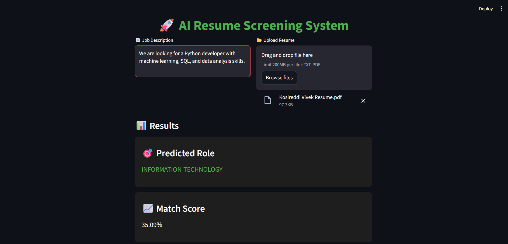
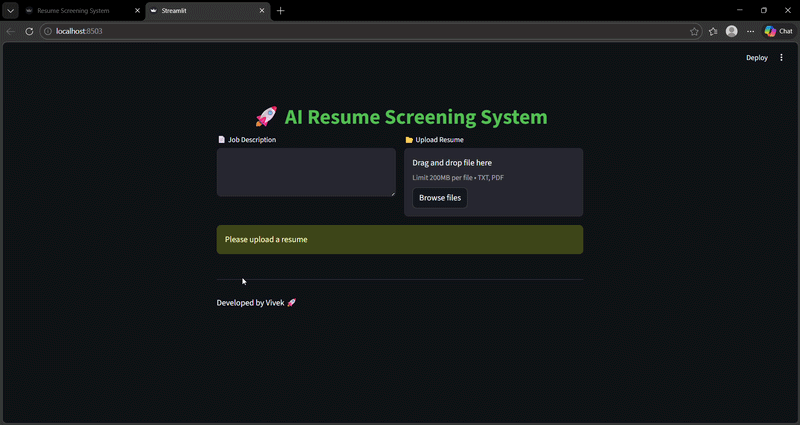

<p align="center">
  
</p>

## 🎥 Demo

<p align="center">
  
</p>

<h1 align="center">🚀 AI Resume Screening System</h1>
<p align="center">AI-powered resume analysis and candidate screening system</p>

<p align="center">
  
  
  
  
</p>

## 📌 Problem Statement

Hiring teams receive hundreds of resumes for a single job role.
Manually reviewing each resume is slow, inconsistent, and error-prone.

This project solves that problem using **Machine Learning and NLP** by automatically analyzing, scoring, and matching resumes with job descriptions.

---

## 🎯 Objective

Build a system that can:

* Extract skills from resumes
* Compare resumes with job descriptions
* Score candidates based on relevance
* Identify missing skills
* Assist recruiters in faster decision-making

---

## 🧠 Technologies Used

* **Python**
* **Natural Language Processing (NLP)**
* **Scikit-learn**
* **TF-IDF Vectorization**
* **Cosine Similarity**
* **Naive Bayes Classifier**
* **Streamlit (Web Application)**

---

## ⚙️ How It Works

### 🔹 1. Text Preprocessing

* Converts text to lowercase
* Removes special characters
* Removes stopwords

### 🔹 2. Skill Extraction

* Matches predefined skill keywords from resume text

### 🔹 3. Resume vs Job Matching

* Uses **TF-IDF** to convert text into vectors
* Uses **Cosine Similarity** to measure similarity

### 🔹 4. Scoring Formula

Final Score =
**0.7 × Similarity + 0.3 × Skill Match**

---

### 🔹 5. Role Prediction

* Uses **Naive Bayes** to predict job category

---

### 🔹 6. Skill Gap Analysis

* Shows missing skills required for the job

---

## 🌐 Features

✔ Upload Resume (PDF / TXT)
✔ Enter Job Description
✔ Predict Job Role
✔ Match Score Calculation
✔ Extracted Skills Display
✔ Missing Skills Identification
✔ Clean and Interactive Web UI

---

## 📸 Application Screenshot


---

## 🎥 Demo (Optional)

*Add your demo GIF here*

```markdown

```

---

## 🖥️ How to Run Locally

```bash
# Install dependencies
pip install streamlit pandas scikit-learn nltk PyPDF2

# Run the application
python -m streamlit run app.py
```

---

## 📊 Sample Output

* **Predicted Role:** Information Technology
* **Match Score:** 35%
* **Extracted Skills:** Python, SQL
* **Missing Skills:** Deep Learning, Data Analysis

---

## 🚀 Future Improvements

* Multiple resume comparison
* Advanced skill extraction using spaCy
* Resume ranking dashboard
* Deploy app online
* Improved UI/UX

---

## 👨‍💻 Author

**Vivek Kosireddy**

---

## 💡 Use Cases

This system can be used by:

* Recruiters
* HR Managers
* Hiring Platforms
* HR-Tech Startups

---

## ⭐ If you like this project

Give it a ⭐ on GitHub!
